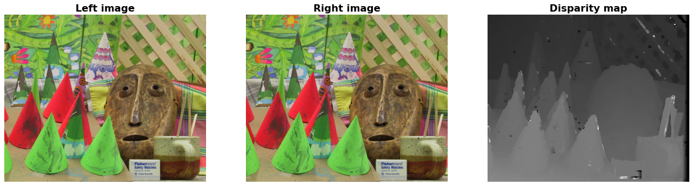

# StereoVisionMultiWay
This repository contains a few implementations of simple stereo block matching algorithms. Stereo block matching algorithms are used to compute disparity maps, which is a key step in computing depth from a pair of images acquired from a stereo camera. Here's an example of the output of the algorithm:



The same algorithm has been implemented in multiple different ways, using different strategies for parallelizing the work to improve performance. For a more in-depth discussion and analysis of the algorithms used, [read the blog post](http://www.mitchellspryn.com/2020/10/18/Improving-The-Performance-Of-Disparity-Map-Computation-Via-Parallelization.html). Shown below is a comparison of all of the different algorithms contained within this repository:


# Build instructions
In order to build this project, the following dependencies need to be installed:

* Ubuntu 18.04
* OpenCV (tested with version 4.0.1)
* OpenMP
* CUDA (tested with version 10.2)
* Clang 9.0.0

Once installed, the program can be built using the standard CMake procedure:

```
mkdir build
cd build
cmake ..
make
```

After building, the following programs will be available:

* **GenerateDisparityVisualization**: This program will take in two images and, using the specified algorithm, generate a disparity image. In this image, the lighter pixels correspond to higher disparity values, which correlate with closer objects.
* **SpeedTest**: This program takes in a series of algorithms, and runs them multiple times, saving the runtime statistics to a file. This program was used to generate data for the blog post.

